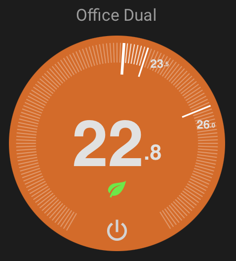

# Thermostat Dark Card

[](https://github.com/hacs/integration)
[](https://github.com/ciotlosm/lovelace-thermostat-dark-card/releases)
[](https://github.com/ciotlosm/lovelace-thermostat-dark-card/actions)
[](LICENSE)
[](https://github.com/ciotlosm/lovelace-thermostat-dark-card/releases)

A Nest-style thermostat card for Home Assistant with a round dial interface. Supports single and dual (heat/cool) setpoints, preset modes, and multiple themes.

<!-- Add screenshot: place your preview image at docs/preview.png -->


**Key features:**
- Pure SVG rendering — lightweight, no images, optimized for low bandwidth
- Single and dual (heat/cool) temperature modes
- Ring drag interaction for setting temperature
- Predictive state feedback while editing
- Dark, light, and transparent themes
- Preset mode indicators (eco, away, home, sleep, boost)
- Responsive — scales to any card size

## Installation

### HACS (Recommended)

[](https://my.home-assistant.io/redirect/hacs_repository/?owner=ciotlosm&repository=lovelace-thermostat-dark-card&category=plugin)

Or manually:
1. Open HACS in Home Assistant
2. Search for "Thermostat Dark Card"
3. Install and restart Home Assistant

### Manual

1. Download `thermostat-dark-card.js` from the [latest release](https://github.com/ciotlosm/lovelace-thermostat-dark-card/releases)
2. Place it in `config/www/`
3. Add the resource in Settings → Dashboards → Resources:
   - URL: `/local/thermostat-dark-card.js`
   - Type: JavaScript Module

## Usage

```yaml
type: custom:thermostat-dark-card
entity: climate.living_room
```

## Configuration

### UI Options

These are available in the visual card editor:

| Option | Type | Default | Description |
|--------|------|---------|-------------|
| `entity` | string | **required** | Climate entity ID |
| `name` | string / false | entity name | Card title. Set to `false` to hide |
| `theme` | string | `dark` | `dark`, `light`, or `transparent` |
| `step` | number | from entity | Temperature step override (celsius only) |
| `readonly` | boolean | `false` | Disable all interaction (display only) |
| `ambient_temperature` | string | — | External temperature sensor entity ID |
| `show_power_toggle` | boolean | `true` | Show power on/off button |
| `show_preset_indicator` | boolean | `true` | Show preset mode icon |
| `pending` | number | `3` | Seconds before committing temperature change |

### Advanced Options (YAML only)

For fine-tuning behavior — not exposed in UI:

| Option | Type | Default | Description |
|--------|------|---------|-------------|
| `idle_zone` | number | `0` | Minimum gap between low/high targets in dual mode |
| `range_min` | number | from entity | Override minimum temperature |
| `range_max` | number | from entity | Override maximum temperature |
| `colors` | object | — | Custom color overrides (see below) |
| `preset_icons` | object | — | Map preset names to icons (see below) |

### Expert Options (use at your own risk)

Internal rendering parameters — changing these may break the dial appearance:

| Option | Type | Default | Description |
|--------|------|---------|-------------|
| `diameter` | number | `400` | SVG viewBox size (all proportions are relative to this) |
| `num_ticks` | number | `150` | Number of tick marks on the ring |
| `tick_degrees` | number | `300` | Arc span of tick marks (degrees) |
| `show_ticks` | boolean | `true` | Show tick marks |

### Themes

- **dark** — Black/dark grey background (default)
- **light** — Light grey background with dark text
- **transparent** — No disc background, use with card-mod for custom backgrounds

Transparent theme example with a room photo:

```yaml
type: custom:thermostat-dark-card
entity: climate.bedroom
theme: transparent
card_mod:
  style: |
    ha-card {
      background: url("/local/bedroom.jpg") center/cover no-repeat;
    }
```

### Color Overrides

Override disc colors via YAML (not available in visual editor):

```yaml
type: custom:thermostat-dark-card
entity: climate.living_room
colors:
  heating: "#ff5500"
  cooling: "#0088ff"
  idle: "#1a1a1a"
  off: "#444444"
```

### Preset Icons

Map custom preset mode names to built-in icons:

```yaml
type: custom:thermostat-dark-card
entity: climate.ecobee
preset_icons:
  vacation: eco
  night: sleep
  party: boost
```

Available icon names: `eco`, `away`, `home`, `sleep`, `boost`, `comfort`, `activity`

Built-in mappings (no config needed):
- `eco`, `away` → leaf
- `home` → house
- `sleep` → moon
- `boost` → flame
- `comfort` → sun
- `activity` → person

Unknown presets show no icon unless mapped via `preset_icons`.

### External Temperature Sensor

Use a separate sensor for the ambient temperature display instead of the climate entity's built-in sensor:

```yaml
type: custom:thermostat-dark-card
entity: climate.living_room
ambient_temperature: sensor.living_room_external_temp
```

## Features

- **Single and dual mode** — Automatically adapts based on entity attributes
- **Ring interaction** — Drag on the tick ring to set temperature
- **Chevron controls** — Tap up/down arrows for precise adjustments
- **Predictive feedback** — Disc color fades to show predicted heating/cooling state while editing
- **Preset indicators** — Shows eco leaf, home, sleep, and other icons
- **Responsive** — Scales to fit any card size

## License

MIT
---

## Support

If you find this card useful, consider buying me a coffee:

<a href="https://www.buymeacoffee.com/gUEVWJc" target="_blank"></a>
