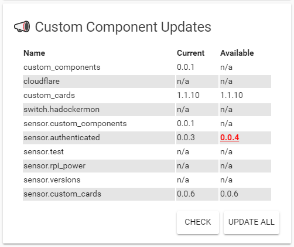

# 📣 Component tracker

A card to track updates for custom components from [https://github.com/custom-components](https://github.com/custom-components).
It uses a [custom component](https://github.com/custom-components/custom_component) that tracks and update versions.



## Options

| Name | Type | Default | Description
| ---- | ---- | ------- | -----------
| type | string | **Required** | `custom:component-tracker`
| entity | string | **Required** | The sensor to use for tracking `sensor.custom_component_tracker`
| title | string | 📣 Custom Component Updates | Name to display on card

## Installation
Make sure you've installed the custom component `custom_components` first.

1. Install the `component-tracker` component by copying `component-tracker.js` to `<config directory>/www/component-tracker.js`

Example:
```bash
wget https://raw.githubusercontent.com/ciotlosm/custom-lovelace/master/component-tracker/component-tracker.js
mv component-tracker.js /config/www/
```

2. Link `component-tracker` inside you `ui-lovelace.yaml` 

```yaml
resources:
  - url: /local/component-tracker.js?v=0
    type: js
```

3. Add a custom card in your `ui-lovelace.yaml`

```yaml
      - type: custom:component-tracker
        entity: sensor.custom_component_tracker
```